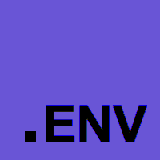
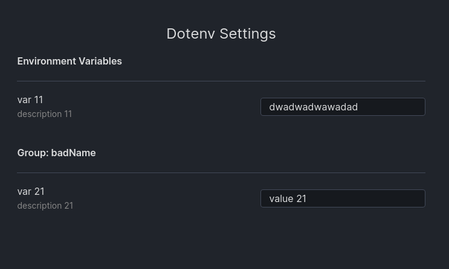
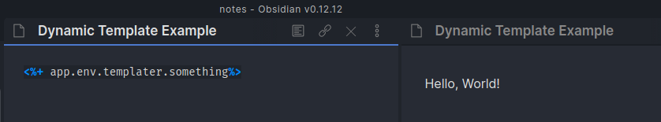
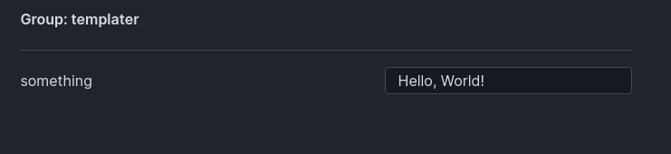

<p align="center">
  <a href="#">
    
  </a>
</p>
<h1 align="center">
  Obsidian Dotenv
</h1>


Easily manage custom variables accessible by other plugins e.g. templater (and it's templates). Useless on its own, this plugin was design to be used with other plugins such as templater and dataview.

Dotenv allows you to add variables to `app.env` e.g. `app.env.customVariable`.

This is useful if you want to distribute customizable templater templates without needing the user to dive into their code and instead easily customize them via dotenv's plugin options menu.

## Usage

> Atm, theres no way to add variables via the settings (this will come as I learn the obsidian plugin api better) and must instead be done manually via the data.json file.

Variables present in data.json will be represented in the settings menu. Changing them here will update them in `app.env`



Variables without a group in `data.json` are saved under the `unnamed` group but don't have this group in `app.env`.

```json
// How variables are exported in app.env
{
  "badName": {
    "var 21": "value 21"
  },
  "var 11": "dwadwadwawadad"
}
```

```json
// data.json
{
  "env": {
    "unnamed": {
      "var 11": {
        "description": "description 11",
        "value": "dwadwadwawadad"
      }
    },
    "badName": {
      "var 21": {
        "description": "description 21",
        "value": "value 21"
      }
    }
  }
}
```

> Variables are nested under `env` in case this plugin ever gets more settings.

## Examples

### Example usage with templater





```json
// data.json
// in the future, this file will not require manual editing
{
  "env": {
    "templater": {
      "something": {
        "value": "Hello, World!"
      }
    }
  }
}
```

## TODO

- [ ] Add ability to add multiple vars to app.env
- [ ] Env groups.
  - [ ] Detele entire env groups
- [ ] Import button that allows people distributing templates to provide a `data.json` that contains their empty/default values and dotenv will handle merging the imported `data.json` with your `data.json`. (groups will be maintained in an import and duplicate names will be merged.)
  - [ ] Warn if merging a group and allow the user to rename either one of the groups.
- [ ] `type` property inside EnvVar to avoid having to parse the strings when getting and setting.
  - [ ] Support for array type.
  - [ ] Support for object type (*idk if you can make nested sections in the settings menu*)
- [ ] See if its possible to add an `app.env.update()` function safely. (*Lots of potential for undefined behaviour as we'd be passing the `update` function references to functions that come from the plugin e.g. the saveData()*)

## Development

Due to the folder structure, you cannot simply place this in your plugins folder and must instead symlink the `build` folder to `.obsidian/plugins/dotenv`